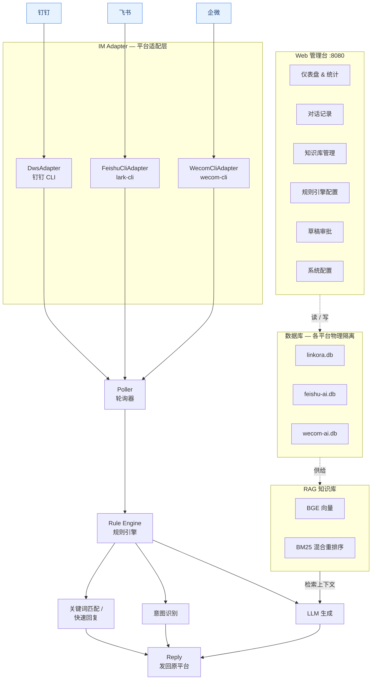

<div align="center">

# 灵桥 · Linkora

**多平台 AI 智能连接中枢**

统一接入钉钉 / 飞书 / 企业微信，融合 RAG 知识库、规则引擎、LLM 对话与 Web 管理台
—— 连接企业智能，桥接无限可能。


[TOC]

[快速开始](#快速开始) · [核心能力](#核心能力) · [配置](#配置速查) · [项目结构](#项目结构) · [贡献指南](#贡献指南) · [近期更新日志](#近期更新日志) · [文档索引](#文档索引)

---

## 项目简介

**灵桥（Linkora）** 是一个把企业级 AI 助手挂到团队日常 IM（钉钉 / 飞书 / 企业微信）上的多平台连接中枢。它让一个「能读懂企业知识、会调用工具、可被人工审核」的 AI 分身，直接出现在你已经在用的群聊和单聊里。

一段典型的链路是：消息进来 → 规则 / 意图分流 → 命中知识库或调用工具 → LLM 生成回复 → 原路发回；全过程在 Web 管理台可查、可调、可审批。三套平台各自独立适配、独立数据库、独立轮询器，数据物理隔离，可按平台独立启停。

> **一句话理解**：把一个能读懂企业知识、会调用工具、可被人工审核的 AI 助手，挂到你已经在用的 IM 上。

| 维度 | 规模（当前代码实测） |
| --- | --- |
| 接入平台 | **3 个**（钉钉 / 飞书 / 企业微信，数据物理隔离） |
| 内置工具 | **38 个**（Tool Calling，单一真源 `BUILTIN_TOOL_MANIFEST`） |
| 意图分类 | **39 个**（9 处置 + 7 动作 + 23 领域） |
| Web 管理台 | **15 个页面（SPA）** / 31 个路由模块 / 150+ 端点 |
| 代码规模 | ~170 个 `src` Python 模块 / 200+ 测试文件 |

---

## 架构总览



分层细节与处理时序见 [架构设计](docs/architecture.md)。

---

## 核心能力

### 多平台接入

| 能力 | 说明 |
| --- | --- |
| 三平台统一 | 钉钉 / 飞书 / 企微各自独立适配器、独立数据库、独立轮询器，可按平台独立启停 |
| 数据隔离 | 物理隔离到不同 SQLite 库，互不干扰 |
| 会话识别 | 自动区分单聊、群聊、系统 / 三方推送，分类展示与处理 |
| 一致性 | 消息编辑 / 撤回实时同步 |
| 防抖合并 | 同一发送者短时间多条消息自动合并为一次处理 |
| 双进程架构 | Web 与后台轮询器（worker）进程分离，改 Web 代码只重启 web 进程不打断 ingestion |

### RAG 知识库

- **入库格式**：PDF / Word / PPT / 图片 OCR / Markdown / URL / 钉钉文档 / 飞书文档 / 维基空间
- **向量检索**：BGE 中文模型本地离线推理，混合重排序（向量 0.6 + BM25 0.4）
- **智能分块**：标题行与正文粘连，避免语义割裂
- **置信度闭环**：低于阈值不强行作答，转草稿 / 转人工

### 规则引擎与意图

- 高频场景**关键词精确匹配**，毫秒级响应，不走 LLM
- **39 个内置意图**：覆盖天气 / 联网搜索 / 日程 / 待办 / 审批 / 考勤 / 组织 / 配置 / 维基等
- **黑白名单**：按会话、用户、关键词多维度控制回复策略
- **决策追踪**：每条消息的意图判定与路由决策可追溯、可查询

### Tool Calling（38 个内置工具）

工具由 `BUILTIN_TOOL_MANIFEST` 单一真源声明并自动注册，按意图关键词自动匹配，覆盖：

- **消息与通讯**：发送消息、撤回、查询未读、会话信息、消息检索、钉钉定向发送
- **知识与文档**：搜索 / 读取钉钉文档、维基空间列表 / 搜索、维基节点列表 / 搜索、知识库检索
- **组织与人员**：通讯录搜索、组织列表、当前组织、个人资料、部门
- **日程与待办**：日历事件、创建待办
- **审批（钉钉，10 个）**：转交审批、待我审批、审批任务、我发起的、我执行的、审批详情、表单列表 / 搜索
- **考勤**：考勤查询
- **会议纪要与知识沉淀**：纪要列表 / 详情
- **记忆**：长期记忆保存 / 召回
- **工具与运维**：联网搜索、天气、系统状态、消息统计、关键词规则管理、配置管理、图片上传

### Web 管理台（`:8080`）

| 页面 | 用途 |
| --- | --- |
| 仪表盘 | 实时统计、活跃会话、消息趋势 |
| 对话记录 | 按平台 / 会话浏览，全文检索，支持批量删除 |
| 知识库 | 文件上传、文档同步、分块预览 |
| 规则引擎 | 关键词规则、意图映射增删改 |
| 草稿审批 | AI 待确认回复，一键批准 / 编辑 / 拒绝 |
| 配置中心 | 在线编辑 `config.yaml`，即时生效 |
| 可观测性 | 日志、健康检查、决策追踪、成本 / 质量看板、路由质量 |

### 智能增强

| 特性 | 说明 |
| --- | --- |
| 长期记忆 | 跨会话记忆，按用户隔离，自动压缩归档 |
| 图片 OCR | 截图自动识别文字，让 LLM "看懂"图片再作答 |
| 摘要压缩 | 长对话自动压缩节省 token；后台异步计算，不阻塞主回复 |
| 风格人格 | 自动从主人历史消息抽取语气 / 表达习惯画像 |
| RAG 门控 | 非 RAG 轮次不注入护栏块，减少 token 浪费 |
| 收信探针 | 连续多轮空轮询即告警，确认机器人正常收信 |
| 定时任务 | 知识库文档定时同步 · SQLite 按平台自动备份 · 长期记忆过期清理 |

---

## 快速开始

### 本地运行

```bash
# 1. 克隆并安装依赖
git clone <repo-url> linkora && cd linkora
python3 -m venv .venv && source .venv/bin/activate
pip install -r requirements.txt

# 2. 准备配置
cp config.yaml.example config.yaml
#    至少填写：llm.api_key / llm.base_url
#              platforms[].adapter.cli_path（对应平台 CLI 路径）

# 3. 平台 CLI 登录（以钉钉为例）
dws auth login
#    飞书：lark-cli login   企业微信：wecom-cli login

# 4. 启动（推荐：双进程分离，web + worker）
.venv/bin/python scripts/run_linkora.py
#    Web 管理台 → http://localhost:8080
```

> **后台常驻**：`nohup .venv/bin/python scripts/run_linkora.py > logs/$(date +%Y%m%d).log 2>&1 &`

`scripts/run_linkora.py` 用法：

```bash
scripts/run_linkora.py                      # 同时拉起 web(默认 8080) + worker
scripts/run_linkora.py --web-port 9000      # 指定 Web 端口
scripts/run_linkora.py --no-worker          # 只跑 web（调试 Web 时常用）
scripts/run_linkora.py --worker-only        # 只跑 worker（纯 ingestion）
scripts/run_linkora.py --dev                # dev 模式（文件变更热重启，both 模式）
scripts/run_linkora.py --no-dedup           # 关闭跨进程日志去重，web/worker 逐行双显
```

也可以单进程直接运行（web 线程 + 后台轮询同进程）：

```bash
.venv/bin/python main.py --mode both     # 等价于 run_linkora 的双进程形态
.venv/bin/python main.py --mode web      # 仅 Web
.venv/bin/python main.py --mode worker   # 仅后台轮询
```

### Docker 部署

```bash
docker compose up -d
```

基础部署见 [部署指南](docs/deployment.md)，各平台前置条件 / CI / systemd 见 [进阶部署](docs/DEPLOY.md)。

---

## 配置速查

`config.yaml` 为 YAML 格式，Web 管理台同步读写，保存即生效。顶层配置段：

```
platforms   多平台主配置（适配器 / 存储 / 轮询器）★
llm         LLM 接入与高级策略        embedding   向量模型
rag         检索策略                  memory      长期记忆
rules       黑白名单 / 关键词 / 意图   tools       工具开关与速率限制
skills      技能系统                  skillhub    技能市场
web         管理台与鉴权              storage     默认存储
logging     日志                      safety      安全护栏
llm_throttle 限流                     dead_letter 死信队列
dws         钉钉 CLI 全局设置
```

### 平台配置（`platforms`）★ 运行期真源

每个平台一段，包含适配器、数据库、轮询器：

```yaml
platforms:
  - id: dingtalk                  # 平台唯一标识
    display_name: 钉钉
    enabled: true
    adapter_type: dingtalk        # dingtalk / feishu / wecom
    storage:
      type: sqlite
      path: ./data/linkora.db     # 独立数据库文件
      backup_enabled: true
      backup_dir: ./data/backups
      backup_interval_hours: 24
    poller:
      interval_seconds: 10        # 轮询间隔
      history_days: 3             # 历史消息回溯天数
      max_concurrent_replies: 4
      skip_msg_types: [system, app]
      # 通知抑制：绝大部分通知已由 msgType / 系统发送者在结构层拦截，
      # 此处仅作「以真人身份推送的纯文本机器通知」的窄签名安全网。
      skip_notification_patterns: []    # 窄正则，精确匹配，绝不写宽泛裸词
      skip_notification_sender_ids: []  # 按发送者 ID 精确静默
    adapter:
      cli_path: /path/to/cli
      timeout: 30

  - id: feishu
    display_name: 飞书
    enabled: true
    adapter_type: feishu
    storage: { path: ./data/feishu-ai.db }
    adapter: { cli_path: lark-cli }

  - id: wecom
    display_name: 企业微信
    enabled: false
    adapter_type: wecom
    storage: { path: ./data/wecom-ai.db }
    adapter: { cli_path: wecom-cli }
```

> 轮询配置的真源在 `platforms[].poller`（按平台隔离），**不存在根级 `poller:` 段**。

### LLM（`llm`）

```yaml
llm:
  api_key: your-api-key
  base_url: https://your-llm-endpoint/v1
  model: default-model
  fallback_api_key: fallback-key    # 故障自动切换
  fallback_model: fallback-model
  advanced:
    low_confidence_threshold: 0.35  # 低置信度转人工阈值
    rag_min_similarity: 0.6         # 自动注入最低相似度
    rag_max_results: 1              # 自动注入最多条数
    rag_max_content_chars: 800      # 单条知识展示上限
```

### 向量模型（`embedding`）

```yaml
embedding:
  enabled: true
  provider: local                   # local / remote
  model: BAAI/bge-small-zh-v1.5     # 更高精度可选 bge-base-zh-v1.5 / bge-large-zh
  offline: true
  top_k: 5
```

全部配置项见 [配置参考](docs/configuration.md)。

---

## 项目结构

```
linkora/
├── main.py                 # 兼容门面；真实入口在 src/platform/lifecycle.py
├── scripts/
│   └── run_linkora.py      # 多进程启动器：拉起 web(:8080) + worker 双进程
├── config.yaml(.example)   # 核心配置 / 完整示例
├── Dockerfile · docker-compose.yml · requirements.txt · pyproject.toml
│
├── src/                    # ~170 个 Python 模块
│   ├── platform/           #   运行时层：启动入口、生命周期、消息循环、优雅降级
│   ├── im_adapter/         #   多平台适配层：CLI 执行引擎 + 各平台适配器
│   ├── dws_adapter/        #   钉钉 CLI 适配器包（chat/media/oa/wiki/minutes/doc…）
│   ├── llm/                #   LLM 编排：agent / client / router / RAG 注入 / 异步摘要
│   ├── memory/             #   存储与检索：SQLite 多仓储 + BGE 向量 + FAISS + 重排序
│   ├── tools/              #   38 个内置工具（registry 单一真源 + 自动注册）
│   ├── skills/             #   技能系统：发现 / 加载 / 热加载 / 路由
│   ├── approval/           #   审批转交子系统（通用层 + 钉钉实现）
│   ├── intent/             #   意图分类注册表（39 意图 + 工具↔意图映射）
│   ├── kb/ · metrics/ · utils/
│   ├── poller*.py          #   消息轮询器与核心子模块（解析/去重/分发/OCR/历史/访问）
│   ├── rule_engine.py      #   规则引擎（关键词 / 意图 / 黑白名单）
│   ├── config.py · config_models.py   #   Pydantic 配置模型
│   └── db_backup.py · doc_sync_scheduler.py · decision_tracker.py · shared_state.py
│
├── web/                    # FastAPI 管理台
│   ├── api.py              #   应用入口   security.py 鉴权（含 SSRF 防护）
│   ├── routers/            #   31 个路由模块，150+ 端点
│   ├── static/             #   前端 SPA：15 页路由（1 个 HTML 外壳 + static/js）
│   └── templates/
│
├── docs/                   # 全部文档（见下方索引）
├── tests/                  # 200+ 测试文件
├── data/ · logs/ · docker/
```

完整目录逐文件说明见 [架构设计](docs/architecture.md) 与 [设计总览](docs/design.md)。

---

## 开发与测试

```bash
# 一律使用项目内 .venv，不要用系统 python
.venv/bin/python -m pytest tests/ -q

# macOS 上涉及 torch 的测试需绕过 OpenMP 重复注册
KMP_DUPLICATE_LIB_OK=TRUE .venv/bin/python -m pytest tests/ -q
```

环境要求、构建流程、贡献规范见 [开发指南](docs/DEV_GUIDE.md)。

---

## 贡献指南

灵桥目前以内部协作方式演进，欢迎按以下约定提交改动。

### 环境约定

- **一律使用项目内 `.venv`** 运行、调试、装包，不要直用系统 `python`，避免「依赖装了却 ModuleNotFoundError」。
- 改完 `src/` 后需**重启 bot**（`./scripts/run_linkora.py`）让修复生效；纯测试改动无需重启。
- 涉及 torch / faiss 的测试在 macOS 上加 `KMP_DUPLICATE_LIB_OK=TRUE`。

### 提交规范（Commit Convention）

采用中文 `type(scope)` 前缀，常用：

| type | 含义 |
| --- | --- |
| `feat` | 新功能 |
| `fix` | 缺陷修复 |
| `refactor` | 重构（零行为变更） |
| `perf` | 性能优化 |
| `test` | 测试补充 / 对齐 |
| `docs` | 文档 |
| `chore` | 杂项 / 配置 |

示例：

```
fix(poller): 黑名单对账自愈改用 conversation_info，避免启动期 dws list-all 挂死
refactor(dws): dws_adapter.py 单文件拆为包（8 mixin + core + 组合根）
```

### 工具 / 意图接线铁律（P0）

新增 agent 工具**必须同步 5 处**，否则会出现启动崩溃或工具漂移：

1. `src/tools/registry.BUILTIN_TOOL_MANIFEST`（单一真源）
2. `src/config.py` 的 `ToolsConfig.available`
3. `config.yaml.example` 的 `tools.available`
4. live `config.yaml` 的 `tools.available`
5. `src/intent/registry.py` 的 `TOOL_ACTION_MAP`

> 已有一道回归测试拦截「`available` 未全部出现在 `TOOL_ACTION_MAP`」类的启动级漂移。

### 代码健壮性约定

- 解析外部 API / LLM JSON 时，显式为 `None` 的字段用 `(d.get("X") or {}).get("Y")` 兜底，而非 `.get("X", {}).get("Y")`（后者对值为 `None` 不生效）。
- LLM 输出一律经 `src/utils/llm_json.extract_json()` 解析，失败时静默降级并记日志，不打 traceback。
- 抓取 / 导航用户 URL 必须过 `web/security.py` 的 SSRF 校验，禁裸 `requests.get` 直连未校验 URL。
- **删消息须连带删图**：`cleanup_old_messages` / `delete_message` / `delete_conversations` 删 DB 行前收集 `image_path`、删后统一调 `src/memory/image_cleanup.py:purge_orphan_images()`，否则 `data/tmp_images` 孤儿图片会永久累积。

### 提交前自检

- 对应改动先 `py_compile`，再跑针对性回归，必要时跑全量。
- 全量：`KMP_DUPLICATE_LIB_OK=TRUE .venv/bin/python -m pytest -q`。
- 提交信息说清「为什么改 / 影响的真实行为」，避免只为让测试变绿而改测试。

---

## 近期更新日志

> 完整历史见 [docs/CHANGELOG.md](docs/CHANGELOG.md)。以下为 2026-08-03 一轮集中的稳定性 / 质量加固（约 25 个提交全绿，全量 3275 测试通过）。

### 启动可靠性与稳定性

- **修复启动卡死（P0）**：黑名单对账自愈原对保密群调用 `chat_message_list(cid,"2020-01-01",1)`，fallback 触发 dws `list-all` 6 年跨度分窗全扫挂死，导致 `LinkoraEngine.__init__` 卡住、bot 启动不动。改用 `chat_conversation_info`（单次轻量调用），启动恢复正常。
- **守护线程异常兜底**：备份 / 指标等守护线程增加循环级 `try/except`，防止单轮异常静默杀死整个线程。
- **备份协调器首轮兜底**：首轮 `backup_on_start` 异常仅记日志并继续周期备份，不再杀死协调器线程。
- **dws 全扫收敛**：`chat_message_list_all` 内部按 7 天窗口切片翻页并去重；`sync_history` 的 range 模式分窗、窗长 30→7 天，消除 list-all 分页触顶截断；`chat_message_list` 透传 `timeout` 给 fallback 扫描。

### 数据完整性与资源清理

- **孤儿图片清理（P0 磁盘泄漏）**：`cleanup_old_messages` / `delete_message` / `delete_conversations` 删消息行时连带删除 `data/tmp_images` 下对应 OCR / 卡片图片（新增 `src/memory/image_cleanup.py`，含越界护栏），避免长期运行撑满磁盘。
- **孤儿 WAL/SHM 清理**：`init_db` 首跑自动清理无主库的孤儿 WAL/SHM 文件。
- **外部响应 None 兜底**：OA 审批卡片显式 `null` 字段导致解析崩溃 → 降级为原始正文；`web_search` / `weather` 显式 `null` 字段兜底为默认容器；工具失败 `result=None` 时的 `.get` 链式调用崩溃被静默捕获。

### 多平台上下文隔离

- **新线程还原平台 ContextVar**：回复锁重试 Timer、异步记忆提取线程池、防抖 Timer 在新线程显式还原平台上下文（或 `contextvars.copy_context().run`），避免飞书 / 企微记忆静默写入钉钉库、或回复发错平台。
- **身份泄漏修复**：修复具名主人数字分身身份泄漏。

### 架构解耦与可维护性

- `dws_adapter.py`（1281 行）拆为包（8 个 mixin + core + 组合根）。
- `config.py`（1126 行）拆为 `config_models.py`（模型）+ 薄加载入口。
- `sqlite_store.py`（1145 行）拆出连接管理 + 向量索引两个 mixin。
- `agent.py` 拆出 `agent_steps` 子模块，`AgentReply` 独立为 `agent_reply.py`。
- 测试对齐真实契约，修掉最后 5 个预存在失败，全量 3275 测试全绿。

### 功能补齐

- 补齐审批 10 个工具的五处接线（P0 防漂移），含「我执行的」审批。
- 补齐 `/api/messages/batch-delete` 端点，修复前端批量删除消息死链。
- 空 RAG 激进清洗不误伤天气百分比，并重置跨请求 RAG 状态。
- 放宽低置信草稿审阅阈值 0.5→0.35，减少审签打扰。

---

## 文档索引

**上手与使用**

| 文档 | 说明 |
| --- | --- |
| [配置参考](docs/configuration.md) | `config.yaml` 全部配置项 |
| [部署指南](docs/deployment.md) | 本地运行、Docker、后台服务 |
| [进阶部署](docs/DEPLOY.md) | 平台前置条件、CI、systemd/launchd、日志、备份 |
| [常见问题](docs/faq.md) | FAQ 与排障 |
| [更新日志](docs/CHANGELOG.md) | 近期变更与历史记录 |

**理解系统**

| 文档 | 说明 |
| --- | --- |
| [架构设计](docs/architecture.md) | 整体架构、分层、目录、处理流程 |
| [设计总览](docs/design.md) | 项目定位、设计哲学、路由模式 |
| [RAG 知识库](docs/rag.md) | 格式支持、分块、检索与重排序 |
| [长期记忆](docs/memory.md) | 数据模型、写入与召回策略 |
| [意图分类](docs/intent-model.md) | 意图体系、工具映射、决策追踪 |
| [工具清单](docs/tools.md) | 内置工具详情 |
| [Web API](docs/web-api.md) | 后端接口概览 |
| [前端模块划分](docs/frontend_module_map.md) | 业务域、路由↔端点映射 |
| [类图](docs/class-diagram.mermaid) · [时序图](docs/sequence-diagram.mermaid) | Mermaid 图 |

**开发与演进**

| 文档 | 说明 |
| --- | --- |
| [开发指南](docs/DEV_GUIDE.md) | 环境、构建、测试、贡献 |
| [Token 优化设计](docs/system_design.md) | 异步摘要 + 降轮次方案 |
| [成本/质量看板](docs/cost_quality_dashboard_design.md) | 看板设计方案 |
| [Phase0 加固](docs/phase0_hardening_design.md) | 安全与稳定性增量设计 |
| [Phase2 引文/置信度](docs/phase2_citation_confidence_design.md) | 引文溯源与置信度产品化 |
| [多平台审计](docs/multi-platform-audit-report.md) | 架构隔离与适配器一致性 |
| [项目审计](docs/project_audit_2026-07-14.md) | 代码质量与安全审计 |
| [文档核对报告](docs/DOC_AUDIT_2026-07-30.md) | 文档与实现一致性核对记录 |

---

## License

本项目基于 **GNU General Public License v3.0 (GPL-3.0)** 发布。

- 完整许可证文本见 [LICENSE](LICENSE)。
- 您可以自由地使用、修改和分发本项目的源代码；任何分发（含修改后版本）都必须以 GPL-3.0 开源，并保留原始版权声明与许可证。
- 本项目按"现状"（as-is）提供，不提供任何明示或暗示的担保。

使用过程中请遵守所在组织各办公平台（钉钉 / 飞书 / 企业微信）开放平台的相关规范与权限要求。
